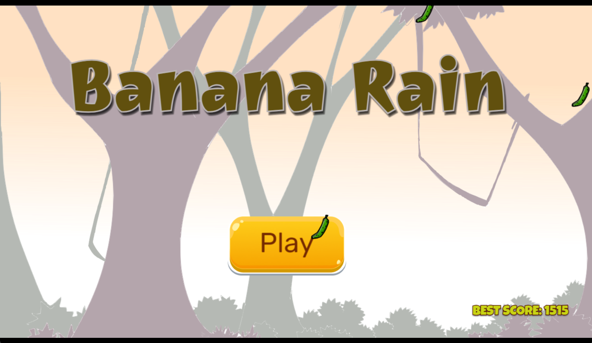
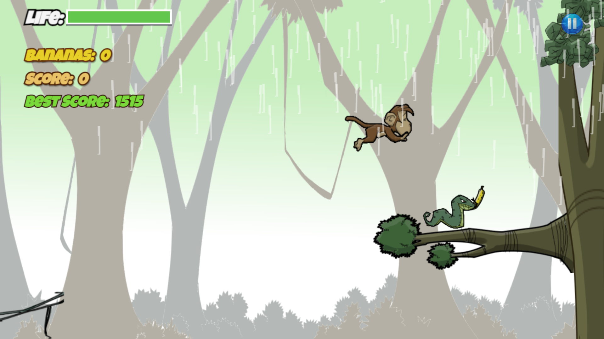
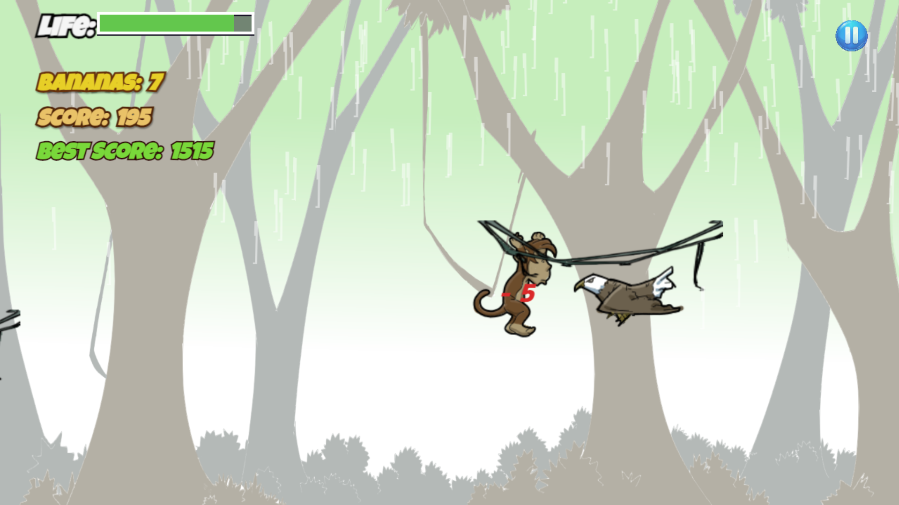
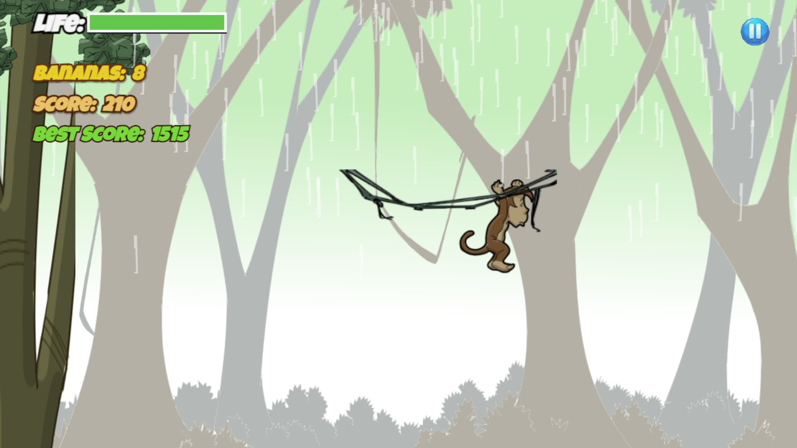

# 🍌 Banana Rain

**Banana Rain** is a 2D arcade platform game developed by **LeVSoft** using GDevelop.

The player controls a monkey collecting bananas while avoiding hazards and dealing with increasingly challenging gameplay.

## 🎮 Features

- 2D arcade/platform gameplay
- Progressive difficulty
- Score and high-score system
- Health and damage mechanics
- Power-ups
- Dynamic spawning system
- Game over and restart flow
- Mobile-friendly controls
- Android support

## 🛠️ Built With

- GDevelop
- JavaScript-based game engine
- Android / HTML5

## 📱 Platform

Android

## 🚀 Project Status

**Version 1.0.0 — Release build completed**

The first Android release is currently being prepared for Google Play.

## 🏢 Developer

Developed by **LeVSoft**.

Banana Rain is one of the first original game projects released under the LeVSoft label.

## 📸 Screenshots

Screenshots and gameplay images will be added here.

## 📄 Source Code

This repository currently serves as a development portfolio and project showcase.

Additional technical material may be made available as the project evolves.# banana-rain
2D arcade platform game developed with GDevelop by LeVSoft.

  
  

  
  

